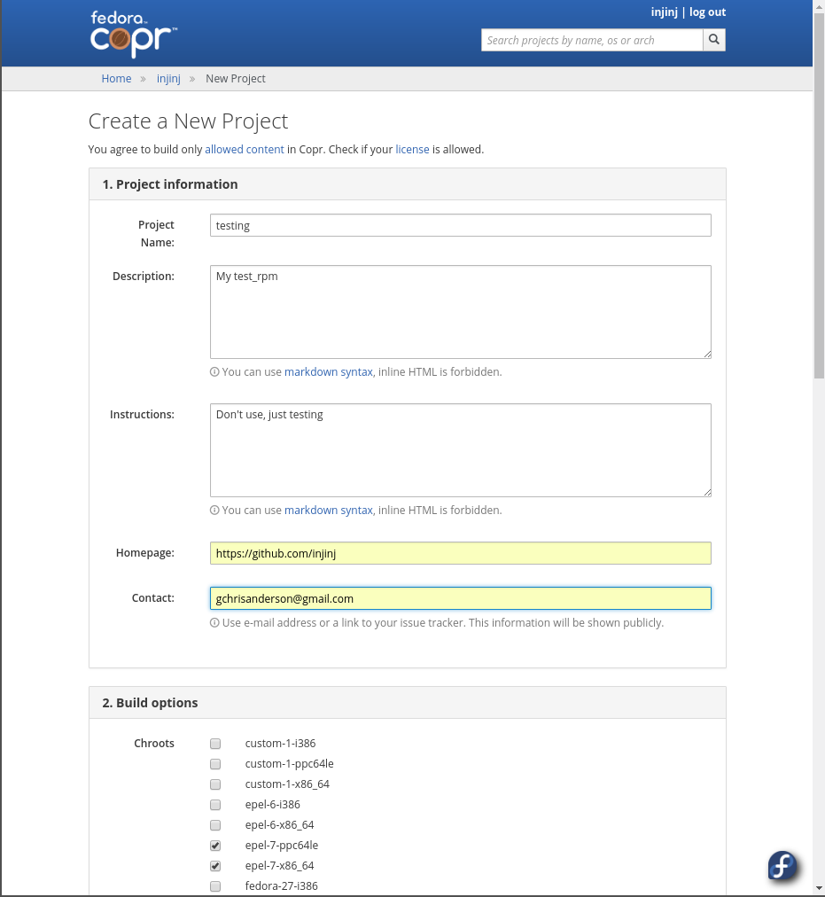
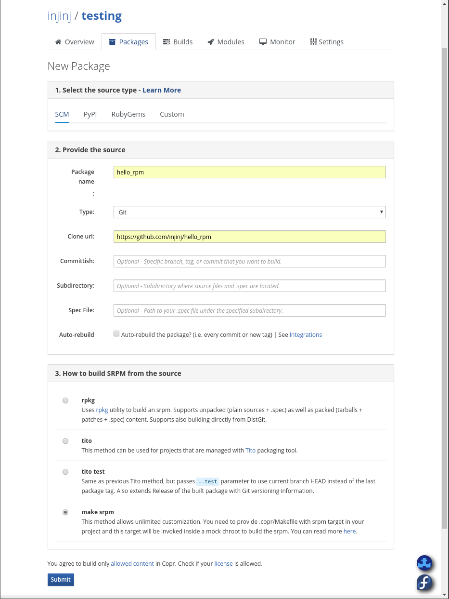
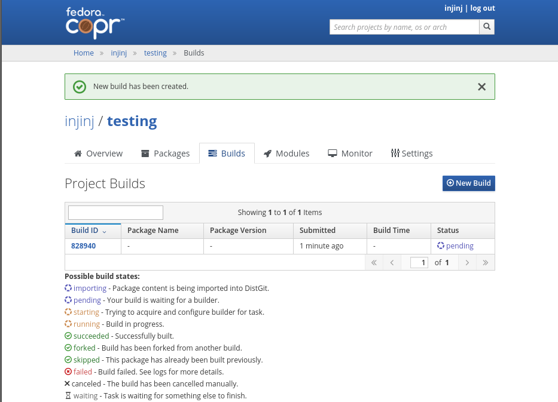
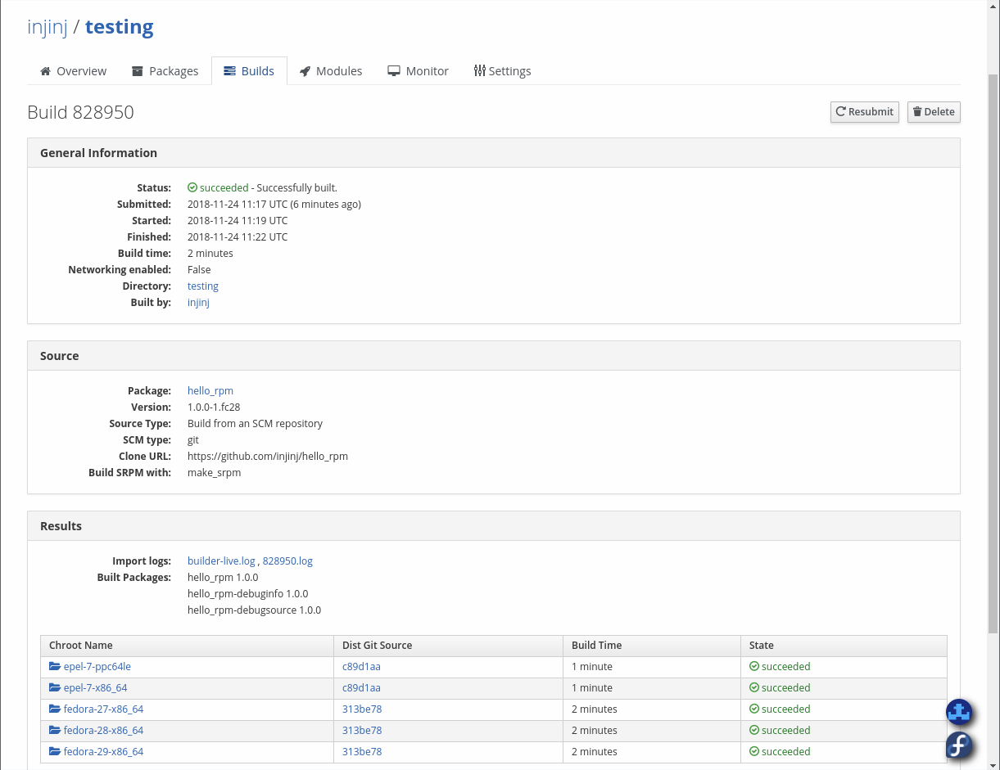

# hello_rpm

[](https://copr.fedorainfracloud.org/coprs/injinj/testing/package/hello_rpm/)

Hello world for copr rpm building

This is an example project which is built using the Fedora copr rpm facility,
which I think is quite cool for it's ability to create multiple RPM packages
targeting x86/x64/ppc over 10 different Linux distros.  This is free for
open source.

The method used here is a git clone, using the make srpm method.  Copr clones
the git repo, than uses the command "make srpm outdir=path".  Then it uses
the source rpm to build the binary rpm file.

This can be tested locally on a RPM based Linux like Fedora which I am using:

```console
$ git clone https://github.com/injinj/hello_rpm
$ make srpm outdir=/tmp/my_path
mkdir -p rpmbuild/{RPMS,SRPMS,BUILD,SOURCES,SPECS}
sed -e "s/99999/1/" \
    -e "s/999.999/1.0.0/" \
    -e "s/__DATE__/Sat Nov 24 2018/" < rpm/hello_rpm.spec > rpmbuild/SPECS/hello_rpm.spec
mkdir -p rpmbuild/SOURCES/hello_rpm-1.0.0
ln -sf ../../../{src,Makefile,.copr} rpmbuild/SOURCES/hello_rpm-1.0.0/
( cd rpmbuild/SOURCES && tar chzf hello_rpm-1.0.0-1.tar.gz --exclude=".*.sw*" hello_rpm-1.0.0 && rm -r -f hello_rpm-1.0.0 )
rpmbuild -D'_srcrpmdir /tmp/my_build_path' -D'_sourcedir rpmbuild/SOURCES' -bs rpmbuild/SPECS/hello_rpm.spec
Wrote: /tmp/my_build_path/hello_rpm-1.0.0-1.fc27.src.rpm
$ ls -l /tmp/my_build_path/hello_rpm-1.0.0-1.fc27.src.rpm
-rw-rw-r-- 1 chris users 7624 Nov 24 02:58 /tmp/my_build_path/hello_rpm-1.0.0-1.fc27.src.rpm
```

The above source RPM will be used to construct the binary RPMs using the arch
and OSes selected on the copr web site.  Here are the steps that occur:

1. git clone the repository (the above)

2. make -f .copr/Makefile srpm outdir=/tmp/path

3. for each arch/OS selected, do 4 to 6 repeatedly, constructiong the RPM

4. rpmbuild extracts the .src.rpm file and execute the %build section of
[hello_rpm.spec](rpm/hello_rpm.spec) which is the next step

5. make build_dir=./usr -j8 dist_bins

6. rpmbuild builds an RPM file using the %files section of
[hello_rpm.spec](rpm/hello_rpm.spec)

Now that the build process is complete, the RPM files can be installed via
dnf copr plugin on any one of the target OS/arches.  Here is Fedora:

```console
$ sudo dnf install dnf-plugins-core
$ sudo dnf copr enable injinj/testing
$ sudo dnf install hello_rpm
$  which hello_world                                                                                                                  
/bin/hello_world
$ hello_world
hello world
$ sudo dnf remove hello_rpm
```

The 'make build_dir=...' above created the hello_world binary and put it into
the /usr/bin path, which is an alias for /bin.  Rpmbuild used the %files
section to copy it and dnf used it to install it.  The rpm spec files can be
complex with config files and man pages and the like, but for the simple cases,
they are not that difficult.

I captured some copr web pages that show the selections made for the above.

1. The project creation screen.  After creating an account, you can create
multiple projects.

<a href="img/new_project.png"></a>

2. The package creation screen.  Within each project, multiple RPMs can be
created by adding packages.

<a href="img/new_package.png"></a>

3. The building screen.  After selecting the arch/OS combinations, go back to
the package and select the rebuild button.  Nothing will be built until this
is done.

<a href="img/building.png"></a>

4. The build succeeded screen.  Select the Builds tab, the the Build ID to find
the build logs and the status of each RPM that is built.

<a href="img/build_succeeded.png"></a>

